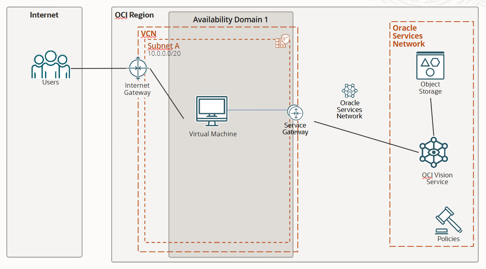

# oci-vision-ai

 

# Oracle Cloud Infrastructure Vision: A Quick Overview

This is an overview of what Oracle Cloud Infrastructure Vision (a.k.a. OCI Vision) is, what it can provide, and how it can be used to your advantage as a company or individual trying to work with Artificial Intelligence.

Of course, the domain we're going to observe is specifically going to focus on Computer Vision, a branch of Artificial Intelligence, that aims to use visual data to automate, or improve the quality of an application.

OCI Vision is a versatile service that focuses on this. We (the users) can access these services in the following ways:
Generative AI Service

Unlock the power of generative AI models equipped with advanced language comprehension for building the next generation of enterprise applications. Oracle Cloud Infrastructure (OCI) Generative AI is a fully managed service available via API to seamlessly integrate these versatile language models into a wide range of use cases, including writing assistance, summarization, and chat.
- Using an OCI SDK: seamless interaction with your favorite programming language, without needing to create your own custom implementation / framework.
- Using the OCI Console: easy-to-use, browser-based interface, by accessing your OCI account and using the services with the web interface provided by Oracle.
- Using the OCI Command-Line Interface (CLI): Quick access and full functionality without programming. The CLI is a package that allows you to use a terminal to operate with OCI.
- Using a RESTful API: Maximum functionality, requires programming expertise. (through requests)

The capabilities of OCI Vision can be divided into two:

- Document AI, or document processing: focuses on extracting or processing data from documents (usually readable)
- Image AI: focuses on detecting elements of an image, like objects, segments of the image...

These are some of the capabilities we can find in OCI Vision:

- Object Detection: Identify objects like people, cars, and trees in images, returning bounding box coordinates (meaning, a rectangle of varying size, depending on the object). (Image AI)
- Image Classification: categorize objects in images. (Image AI)
- Optical Character Recognition (OCR): Locate and digitize text in images. (Document AI)
- Face Recognition: detecting faces in images and key points in faces, which can be later used to process the face's mood, position... (Image AI)

If you're unhappy with the set of elements being recognized in OCI Vision, or you're trying to detect something in images that is uncommon / not real (e.g. a character in a Disney movie, or a new species of animal), you can also create your own *Custom Model*:

- Custom Object Detection: build models to detect custom objects with bounding box coordinates.
- Custom Image Classification: create models to identify specific objects and scene-based features.

## Document AI

> **Note**: Document AI features are available until January 1, 2024. Post that, they will be available in another OCI service called OCI Document Understanding.

There are lots of things that we can extract from a document: information from receipts (prices, dates, employees...), tabular data (if the document has tables/spreadsheets on it), or simply text contained in a document.

All of this is specially useful for retail or HR companies, to manage their inventories, transactions, and manage their resources and activities more efficiently. It can also generate searchable, summarized PDFs from all this data, uploaded to the Cloud and accessible anywhere.

### Supported File Formats

Here's a list of supported file formats:

- JPG
- PNG
- JPEG
- PDF
- TIFF (great for iOS enthusiasts)

Oracle Cloud Infrastructure Vision is a robust, flexible and cost-effective service for Computer Vision tasks. Oh, and extremely speedy!

Whether you're dealing with images or documents, OCI Vision has all the tools you need, so make sure to give them a try.

## Demo

[OCI Vision Overview - Exploring the Service](https://www.youtube.com/watch?v=eyJm7OlaRBk&list=PLPIzp-E1msraY9To-BB-vVzPsK08s4tQD&index=4)

## Tutorial

Here’s an use case being solved with OCI Vision + Python:

[App Pattern: OCI Vision Customized Object Detector in Python](https://www.youtube.com/watch?v=B9EmMkqnoGQ&list=PLPIzp-E1msraY9To-BB-vVzPsK08s4tQD&index=2)

## Physical Architecture

## Contributing

This project is open source.  Please submit your contributions by forking this repository and submitting a pull request!  Oracle appreciates any contributions that are made by the open source community.

## License

Copyright (c) 2022 Oracle and/or its affiliates.

Licensed under the Universal Permissive License (UPL), Version 1.0.

See [LICENSE](LICENSE) for more details.

ORACLE AND ITS AFFILIATES DO NOT PROVIDE ANY WARRANTY WHATSOEVER, EXPRESS OR IMPLIED, FOR ANY SOFTWARE, MATERIAL OR CONTENT OF ANY KIND CONTAINED OR PRODUCED WITHIN THIS REPOSITORY, AND IN PARTICULAR SPECIFICALLY DISCLAIM ANY AND ALL IMPLIED WARRANTIES OF TITLE, NON-INFRINGEMENT, MERCHANTABILITY, AND FITNESS FOR A PARTICULAR PURPOSE.  FURTHERMORE, ORACLE AND ITS AFFILIATES DO NOT REPRESENT THAT ANY CUSTOMARY SECURITY REVIEW HAS BEEN PERFORMED WITH RESPECT TO ANY SOFTWARE, MATERIAL OR CONTENT CONTAINED OR PRODUCED WITHIN THIS REPOSITORY. IN ADDITION, AND WITHOUT LIMITING THE FOREGOING, THIRD PARTIES MAY HAVE POSTED SOFTWARE, MATERIAL OR CONTENT TO THIS REPOSITORY WITHOUT ANY REVIEW. USE AT YOUR OWN RISK.
